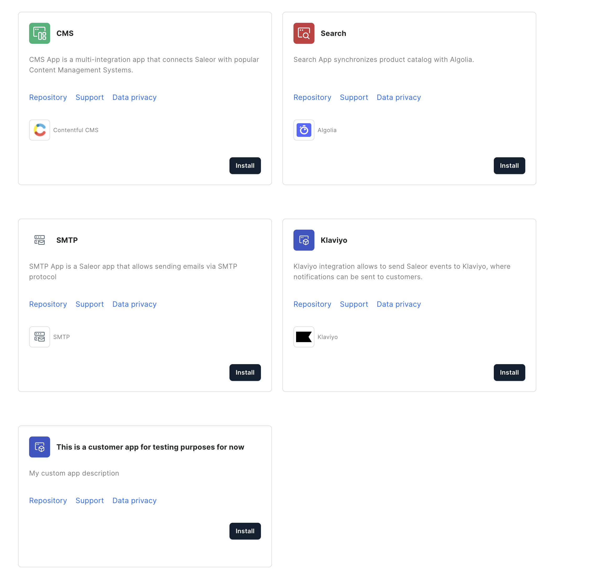

# Saleor Apps Marketplace

The Saleor Apps chart includes a built-in marketplace feature that allows you to deploy and manage both official Saleor apps and your own custom apps. The marketplace provides a centralized location in your Saleor Dashboard where you can discover and install apps with a single click.



## Adding Custom Apps

You can easily add your own custom apps to the marketplace by adding them to the `apps` section in your values file. Here's an example:

```yaml
apps:
  my-custom-app:
    enabled: true
    hostname: my-custom-app.apps.example.com
    port: 8000  # Port that your app listens on
    image:
      registry: my-registry.io  # Optional, defaults to common.image.registry
      repository: myorg/my-custom-app  # Required
      tag: v1.0.0  # Required
    manifestPath: /api/manifest  # Optional, defaults to /api/manifest
    ingress:
      enabled: true
      annotations:
        cert-manager.io/cluster-issuer: letsencrypt-prod  # Optional
      tls:
        enabled: true
        secretName: ""  # Optional
    # Marketplace metadata
    marketplace:
      name: "My Custom App"  # Required if app is enabled
      logo:  # Optional
        source: "https://example.com/logo.svg"
        color: "#000000"
      description:  # Optional
        en: "Description of my custom app"
      integrations:  # Optional
        - name: "Integration Service"
          logo:
            light:
              source: "https://example.com/logo-light.svg"
            dark:
              source: "https://example.com/logo-dark.svg"
      privacyUrl: "https://example.com/privacy"  # Optional
      supportUrl: "https://example.com/support"  # Optional
      repositoryUrl: "https://github.com/myorg/my-app"  # Optional
```

## Configuration Reference

### App Configuration

| Parameter | Description | Default |
|-----------|-------------|---------|
| `enabled` | Enable or disable the app | `false` |
| `hostname` | Hostname where the app will be accessible | `nil` |
| `port` | Port that the app listens on | `3000` |
| `image.registry` | Docker registry for the app | Value from `common.image.registry` |
| `image.repository` | Docker image repository | Required |
| `image.tag` | Docker image tag | Required |
| `manifestPath` | Path to the app manifest | `/api/manifest` |

### Marketplace Configuration

| Parameter | Description | Required |
|-----------|-------------|----------|
| `marketplace.name` | Display name of the app | Yes |
| `marketplace.logo.source` | URL to the app's logo | No |
| `marketplace.logo.color` | Background color for the logo | No |
| `marketplace.description.en` | English description of the app | No |
| `marketplace.integrations` | List of integrations the app provides | No |
| `marketplace.privacyUrl` | URL to privacy policy | No |
| `marketplace.supportUrl` | URL to support page | No |
| `marketplace.repositoryUrl` | URL to source code repository | No |

## How It Works

The chart creates:
1. A deployment for each enabled app
2. An ingress for each app to make it accessible
3. A marketplace JSON endpoint that Saleor Dashboard uses to display available apps

When you add a custom app:
1. The app will be deployed using the specified image
2. It will be accessible at the specified hostname
3. The app will appear in the Saleor Dashboard marketplace
4. Users can install it with one click, just like official apps

## Best Practices

1. Always use HTTPS by enabling TLS in the ingress configuration
2. Provide clear and helpful descriptions for your apps
3. Include relevant integration information if your app integrates with third-party services
4. Keep your app manifests up to date
5. Consider using semantic versioning for your app image tags
